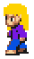
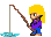

  

  
  &nbsp;&nbsp;&nbsp;
  

  
  

<h2>What teams can evaluate quickly</h2>

<table width="100%">
<tr>
<td width="33%" valign="top"><h3>Role fit</h3>
Frontend or full-stack engineer · PHP · Blade · JavaScript
</td>
<td width="33%" valign="top"><h3>Public proof</h3>
66 repositories · 0 stars
</td>
<td width="33%" valign="top"><h3>Momentum</h3>
460 contributions · 142 active days
</td>
</tr>
</table>

Full Stack Web Developer

<h2>Proof at a glance</h2>

  

<h2>Selected work</h2>

<table width="100%">
<tr>
<td width="50%" valign="top">
<h3><a href="https://github.com/DeboraCocchi/proj-html-vuejs">proj-html-vuejs</a></h3>

A selected public project.

 ⭐ 0 · 🍴 0

<a href="https://github.com/DeboraCocchi/proj-html-vuejs">Read the repository →</a>

</td>
<td width="50%" valign="top">
<h3><a href="https://github.com/DeboraCocchi/laravel-api">laravel-api</a></h3>

A selected public project.

 ⭐ 0

</td>
</tr>
<tr>
<td width="50%" valign="top">
<h3><a href="https://github.com/DeboraCocchi/vite-boolflix">vite-boolflix</a></h3>

A selected public project.

 ⭐ 0

</td>
<td width="50%" valign="top">
<h3><a href="https://github.com/DeboraCocchi/laravel-dc-comics">laravel-dc-comics</a></h3>

A selected public project.

 ⭐ 0

</td>
</tr>
</table>

<h2>Technical toolkit</h2>

  

<h2>Consistency signal</h2>

  

<table width="100%">
<tr>
<td width="62%" valign="middle"><h2>Let’s talk about the next build</h2>
Open to thoughtful teams, ambitious products, and useful engineering work.
</td>
<td width="38%" valign="middle" align="right"></td>
</tr>
</table>

 

Debora Cocchi · recruiter-ready profile generated with <a href="https://www.gitskins.com/readme-generator">GitSkins</a>

