

   <a href="https://github.com/deboracocchi"></a><a href="https://www.linkedin.com/in/debora-cocchi/"></a>

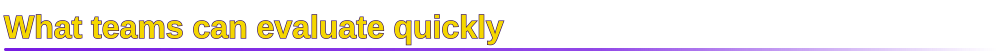

  

Full Stack Web Developer

  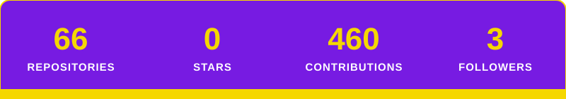

<a href="https://github.com/DeboraCocchi/proj-html-vuejs"></a>
<a href="https://github.com/DeboraCocchi/laravel-api"></a>
<a href="https://github.com/DeboraCocchi/vite-boolflix"></a>
<a href="https://github.com/DeboraCocchi/laravel-dc-comics"></a>

  

  

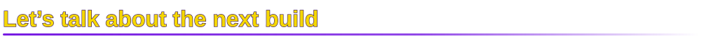

Open to thoughtful teams, ambitious products, and useful engineering work.

  

 

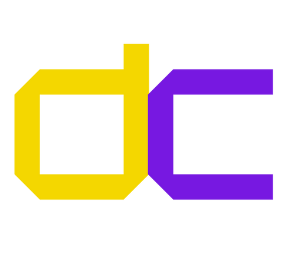

Debora Cocchi · recruiter-ready profile generated with <a href="https://www.gitskins.com/readme-generator">GitSkins</a>

